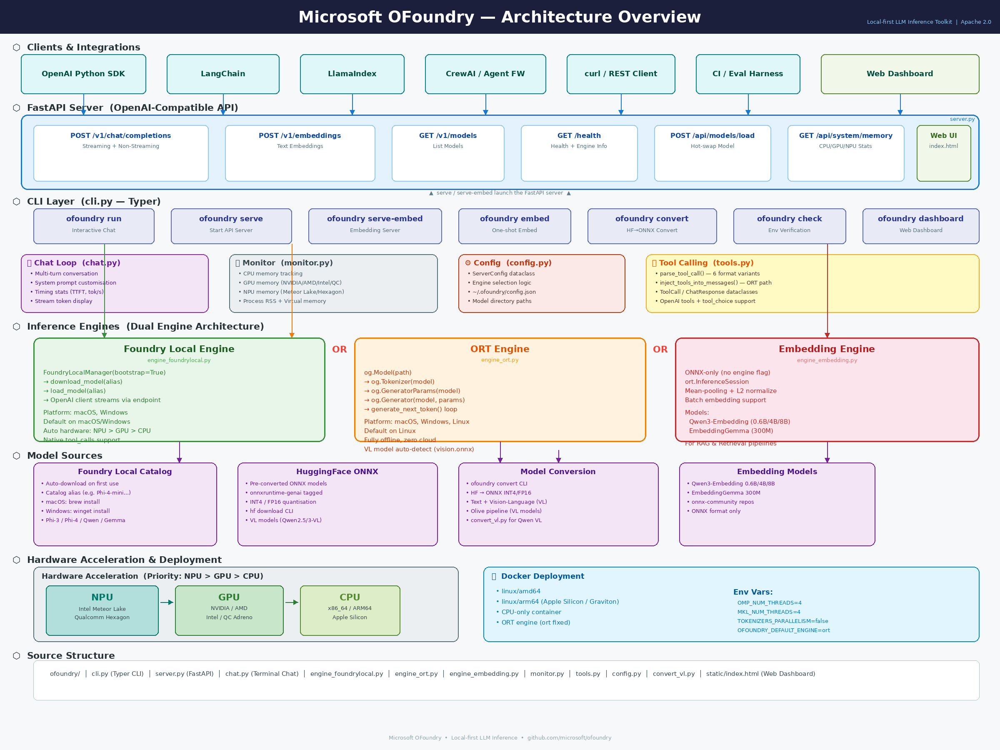

# oBeaver

<p align="center">
  
</p>

**oBeaver** is a local-first LLM inference toolkit designed for AI developers and engineers who need to run models on their own hardware — no cloud, no API keys, no data leaving your machine. It exposes an **OpenAI-compatible API** so your existing agent pipelines, RAG stacks, and evaluation harnesses work out of the box with zero code changes.

> 中文说明请见 [README.zh-cn.md](README.zh-cn.md)

📖 **Documentation:** <https://microsoft.github.io/obeaver>

---

## Table of Contents

- [oBeaver](#obeaver)
  - [Table of Contents](#table-of-contents)
  - [Key Features](#key-features)
  - [Why oBeaver?](#why-obeaver)
- [Getting Started](#getting-started)
  - [Requirements](#requirements)
    - [Common](#common)
    - [Foundry Local engine](#foundry-local-engine)
    - [ORT engine](#ort-engine)
    - [Embedding engine (ONNX-only)](#embedding-engine-onnx-only)
  - [Installation](#installation)
  - [Environment Check](#environment-check)
  - [Getting Models](#getting-models)
    - [Foundry Local catalog (macOS/Windows)](#foundry-local-catalog-macoswindows)
    - [ONNX GenAI models (all platforms)](#onnx-genai-models-all-platforms)
    - [Embedding models](#embedding-models)
- [Basic Usage](#basic-usage)
  - [Chat Locally (Terminal)](#chat-locally-terminal)
  - [Serve an OpenAI-compatible API](#serve-an-openai-compatible-api)
  - [Web Dashboard](#web-dashboard)
- [Advanced Features](#advanced-features)
  - [Text Embeddings (for RAG \& Retrieval)](#text-embeddings-for-rag--retrieval)
    - [CLI](#cli)
    - [Embedding server](#embedding-server)
    - [Use with OpenAI SDK](#use-with-openai-sdk)
  - [Tool Calling (Agentic Workflows)](#tool-calling-agentic-workflows)
    - [How it works](#how-it-works)
    - [Supported output formats (auto-detected)](#supported-output-formats-auto-detected)
    - [Example: two-turn tool-calling agent](#example-two-turn-tool-calling-agent)
    - [curl examples](#curl-examples)
  - [Model Conversion](#model-conversion)
    - [Text Models (default)](#text-models-default)
    - [Vision-Language (VL) Models](#vision-language-vl-models)
      - [Supported VL Models](#supported-vl-models)
      - [Conversion Commands](#conversion-commands)
- [Examples \& Integrations](#examples--integrations)
  - [Use with the OpenAI Python SDK](#use-with-the-openai-python-sdk)
  - [Integration Patterns](#integration-patterns)
    - [With LangChain](#with-langchain)
    - [With LlamaIndex](#with-llamaindex)
    - [In CI / automated evaluation](#in-ci--automated-evaluation)
- [Reference](#reference)
  - [API Reference](#api-reference)
    - [Chat server (`obeaver serve`)](#chat-server-obeaver-serve)
    - [Embedding server (`obeaver serve-embed`)](#embedding-server-obeaver-serve-embed)
    - [Request parameters (`/v1/chat/completions`)](#request-parameters-v1chatcompletions)
  - [Docker](#docker)
    - [Build](#build)
    - [Run](#run)
    - [Environment variables](#environment-variables)
  - [Architecture](#architecture)
    - [Engine selection logic](#engine-selection-logic)
    - [Foundry Local engine flow](#foundry-local-engine-flow)
    - [ORT engine flow](#ort-engine-flow)
    - [Tool-calling internals](#tool-calling-internals)
  - [License](#license)

---

## Key Features

- **Dual inference engine** — choose the right backend for your platform:

  | Engine | Platform | Description |
  |--------|----------|-------------|
  | **Foundry Local** (default on macOS/Windows) | macOS, Windows | Powered by [Microsoft Foundry Local](https://github.com/microsoft/foundry-local). Automatic model download, hardware acceleration (NPU > GPU > CPU), launched via a catalog alias. |
  | **ORT** (default on Linux) | macOS, Windows, **Linux** | Powered by [ONNX Runtime GenAI](https://github.com/microsoft/onnxruntime-genai). Loads a local `.onnx` model directory — fully offline, zero cloud dependency. |

- **OpenAI-compatible HTTP server** — `POST /v1/chat/completions` (streaming + non-streaming), `POST /v1/embeddings`
- **Interactive CLI chat** with multi-turn conversation, timing stats (TTFT, tok/s), and custom system prompts
- **Function / tool calling** — full OpenAI `tools` + `tool_choice` support for building agentic workflows locally
- **Text embeddings** — dedicated ONNX embedding engine (Qwen3-Embedding, EmbeddingGemma) for RAG pipelines
- **Model conversion** — convert Hugging Face models to optimised ONNX INT4/FP16 format via built-in CLI
- **Docker-ready** — CPU container for `linux/amd64` and `linux/arm64` (Apple Silicon, AWS Graviton)

> **Linux note:** Foundry Local is not available on Linux. The engine is fixed to `ort`; passing `--engine foundry` will exit with an error.

---

## Why oBeaver?

| Pain point | How oBeaver solves it |
|---|---|
| **Cloud costs & latency** | Run inference locally on CPU, GPU, or NPU — zero network round-trips. |
| **Data privacy** | Models run on-device. Nothing leaves your machine. |
| **OpenAI SDK lock-in** | Drop-in `/v1/chat/completions` and `/v1/embeddings` endpoints — switch between local and cloud by changing one `base_url`. |
| **Multi-model experimentation** | Swap engines and models with a single CLI flag. Compare Phi-3, Phi-4, Qwen, Gemma, and more. |
| **Linux / CI headless environments** | Fully offline ORT engine works everywhere — perfect for Docker, CI pipelines, and air-gapped servers. |
| **Tool-calling / agentic workflows** | Built-in OpenAI function-calling support across both engines — build agents that run entirely on-device. |

---

# Getting Started

This section walks you through everything needed to get oBeaver up and running on your machine.

## Requirements

- **Python 3.12+**
- Foundry Local system daemon (macOS / Windows only, for Foundry Local engine):
  ```bash
  brew install microsoft/foundrylocal/foundrylocal   # macOS
  winget install Microsoft.FoundryLocal              # Windows
  ```

> **Note:** On Linux, Foundry Local is not available. The engine defaults to ORT.

---

## Installation

```bash
git clone https://github.com/microsoft/obeaver.git
cd obeaver
pip install -e .
```

---

## Initialise Model Directory

After installation, configure the default model save location. This creates the required sub-folders (`ort/`, `foundrylocal/`, `cache_dir/`) automatically:

```bash
obeaver init
```

You can also pass a path directly:

```bash
obeaver init ~/my-models
```

> **💡 Tip:** The configuration is saved to `~/.obeaver/config.json`. Run `obeaver` with no arguments to view the welcome banner showing your current model directory paths at any time.

---

## Environment Check

Verify your setup:

```bash
obeaver check
```

```
────────────────── obeaver environment check ──────────────────
Platform: macOS

✓  Foundry Local CLI found: /usr/local/bin/foundry
   Version: 0.8.119
✓  foundry-local-sdk (Python) is installed.
   SDK version: 0.5.1
────────────────────────────────────────────────────────────────
```

### List Local Models

Use `obeaver models` to list all local models discovered under the configured model directory:

```bash
obeaver models
```

This scans the `foundrylocal/` and `ort/` sub-folders and shows each model's name, engine type, and category (Text, Vision + Text, or Embeddings).

---

## Getting Models

Before using oBeaver, you need models. Choose based on your engine:

### Foundry Local catalog (macOS/Windows)

No manual download needed — pass a catalog alias and Foundry handles it:

```bash
obeaver run Phi-4-mini-instruct-generic-cpu:5   # auto-downloads on first use
```

> **💡 Tip:** Run `obeaver models` to list all locally cached models. On macOS/Windows, run `foundry model list` to browse the full Foundry Local catalog for more aliases.

### ONNX GenAI models (all platforms)

Download pre-converted models from Hugging Face. Look for repos tagged `onnxruntime-genai` or use [Olive](https://github.com/microsoft/Olive) to convert your own.

> **🔑 Hugging Face Authentication Required:** Downloading models with `hf download` or `obeaver convert` requires Hugging Face CLI authentication. If you haven't logged in yet:
>
> ```bash
> pip install -U huggingface-hub
> huggingface-cli login
> ```
>
> You will be prompted to enter an access token. If you don't have one, visit [huggingface.co/settings/tokens](https://huggingface.co/settings/tokens) to create a free account and generate a token. Some gated models (Llama, Mistral, etc.) also require accepting the model's license on the Hugging Face model page before download.
>
> Alternatively, set the environment variable: `export HF_TOKEN='your_token_here'`
>
> Run `obeaver check` to verify your Hugging Face authentication status.

```bash
# install the HF CLI
pip install -U "huggingface_hub[cli]"

# download Phi-3 mini (INT4, CPU-optimised)
hf download microsoft/Phi-3-mini-4k-instruct-onnx \
  --include "cpu_and_mobile/cpu-int4-rtn-block-32-acc-level-4/*" \
  --local-dir ./models/ort/phi3-mini-int4
```

### Embedding models

Download from [huggingface.co/onnx-community](https://huggingface.co/onnx-community):

| Model | Params | HF repo |
|-------|--------|---------|
| Qwen3-Embedding | 0.6B | `onnx-community/Qwen3-Embedding-0.6B` |
| Qwen3-Embedding | 4B | `onnx-community/Qwen3-Embedding-4B` |
| Qwen3-Embedding | 8B | `onnx-community/Qwen3-Embedding-8B` |
| EmbeddingGemma | 300M | `onnx-community/embeddinggemma-300m-ONNX` |

```bash
hf download onnx-community/Qwen3-Embedding-0.6B \
  --local-dir ./models/Qwen3-Embedding-0.6B
```

---

# Basic Usage

Now that you have oBeaver installed and models ready, here are the core ways to use it.

## Chat Locally (Terminal)

Start an interactive multi-turn chat in your terminal.

**Foundry Local** (macOS/Windows — auto-downloads models from catalog):
```bash
obeaver run Phi-4-mini-instruct-generic-cpu:5
obeaver run Phi-4-mini-instruct-generic-cpu:5 --timings   # show TTFT + tok/s
```

**ORT engine** (all platforms — point to a local ONNX model directory):
```bash
obeaver run --engine ort ./models/phi3-mini-int4
```

**VL (Vision-Language) models** — engine is auto-detected, no `--engine` flag needed:
```bash
obeaver run ./models/Qwen2.5-VL-3B-Instruct_VL_ONNX_INT4_CPU
obeaver run ./models/Qwen3-VL-2B-Instruct_VL_ONNX_INT4_CPU
```

> VL models require the ORT engine. When a VL model directory is detected (contains `vision.onnx`), the engine is automatically set to `ort` — you never need to specify `--engine ort` manually.

---

## Serve an OpenAI-compatible API

Launch a local HTTP server that exposes OpenAI-compatible endpoints:

```bash
obeaver serve Phi-4-mini-instruct-generic-cpu:5                          # Foundry Local
obeaver serve --engine ort ./models/phi3-mini-int4   # ORT
obeaver serve ./models/Qwen3-VL-2B-Instruct_VL_ONNX_INT4_CPU  # VL (auto-detected)
```

Once the server is running, any OpenAI-compatible client can connect to `http://127.0.0.1:18000/v1`.

**VL model curl examples:**

```bash
# Local image
curl -s http://127.0.0.1:18000/v1/chat/completions \
  -H "Content-Type: application/json" \
  -d '{
    "messages": [{
      "role": "user",
      "content": [
        {"type": "image_url", "image_url": {"url": "./cat.jpg"}},
        {"type": "text", "text": "Describe this image"}
      ]
    }]
  }'

# Remote image URL + streaming
curl -s http://127.0.0.1:18000/v1/chat/completions \
  -H "Content-Type: application/json" \
  -d '{
    "stream": true,
    "messages": [{
      "role": "user",
      "content": [
        {"type": "image_url", "image_url": {"url": "https://example.com/photo.jpg"}},
        {"type": "text", "text": "What is in this image?"}
      ]
    }]
  }'
```

---

## Web Dashboard

Launch the real-time monitoring dashboard with the `dashboard` command:

```bash
obeaver dashboard               # Foundry Local engine, default port 1573
obeaver dashboard -e ort         # ORT engine, scans ./models for ONNX models
```

Then open in your browser:

```
http://127.0.0.1:1573/
```

<p align="center">
  
</p>

The dashboard includes:

- **Model Selector** — switch between cached models at runtime; NPU-accelerated models are marked with a ⚡ badge
- **System Info Bar** — loaded model name, engine type, platform, and Python version with live health status
- **CPU Memory** — total, used, available, and real-time utilisation gauge
- **GPU Memory** — detected GPU device and memory (NVIDIA, AMD, Intel, Qualcomm Adreno)
- **NPU Memory** — detected NPU device and memory (Intel Meteor Lake, Qualcomm Hexagon)
- **Process Memory** — resident and virtual memory of the oBeaver server process
- **Inference Parameters** — temperature, top-p, top-k, max tokens, repetition penalty with Creative/Balanced/Precise presets
- **Chat Interface** — send messages to the loaded model directly from the browser with streaming response and performance stats (TTFT, tok/s, token count)
- **Conversation History** — sidebar with saved conversations and system prompt configuration
- **Server Logs** — live request log with method, path, status, and timing
- **Export** — export conversations as JSON or Markdown

<p align="center">
  
</p>

<p align="center">
  
</p>

The built-in chat interface lets you test the model directly from the browser with real-time streaming and performance metrics:

<p align="center">
  
</p>

Memory statistics refresh automatically every 3 seconds. The health status indicator shows whether the server is online.

---

# Advanced Features

## Text Embeddings (for RAG & Retrieval)

The embedding engine is **ONNX-only** — no `--engine` flag needed.

### CLI

```bash
# One-shot embedding
obeaver embed ./models/Qwen3-Embedding-0.6B "Hello, world!"

# Interactive loop
obeaver embed ./models/embeddinggemma-300m-ONNX
```

### Embedding server

```bash
obeaver serve-embed ./models/Qwen3-Embedding-0.6B           # default port 18001
obeaver serve-embed ./models/embeddinggemma-300m-ONNX -p 8002
```

### Use with OpenAI SDK

```python
from openai import OpenAI

client = OpenAI(base_url="http://127.0.0.1:18001/v1", api_key="unused")

response = client.embeddings.create(
    model="Qwen3-Embedding-0.6B",
    input=["Hello, world!", "Embeddings are useful."],
)
for item in response.data:
    print(f"index={item.index}  dim={len(item.embedding)}")
```

---

## Tool Calling (Agentic Workflows)

Both engines support the [OpenAI function-calling](https://platform.openai.com/docs/guides/function-calling) interface — build agents that plan, call tools, and reason entirely on-device.

### How it works

| Engine | Strategy |
|--------|----------|
| **Foundry Local** | Tools forwarded natively via the standard OpenAI `tools` parameter. Response may carry native `tool_calls` or `functools[...]` format — both normalised automatically. |
| **ORT** | Tools serialised as JSON Schema inside the system prompt. Model replies with a `<tool_call>{...}</tool_call>` block; `parse_tool_call()` extracts and validates it. |

Both engines return the same `ChatResponse` structure — your application code is engine-agnostic.

### Supported output formats (auto-detected)

| Format | Example |
|--------|---------|
| `<tool_call>` block | `<tool_call>{"name": "get_weather", "arguments": {"city": "Paris"}}</tool_call>` |
| Phi-3 native | `<\|function_calls\|>{...}<\|/function_calls\|>` |
| Mistral-style | `<functioncall>{...}</functioncall>` |
| Markdown code block | `` ```json {...} ``` `` |
| OpenAI-legacy wrapper | `{"function_call": {"name": ..., "arguments": ...}}` |
| Bare JSON | `{"name": "...", "arguments": {...}}` |

### Example: two-turn tool-calling agent

```python
from openai import OpenAI
import json

client = OpenAI(base_url="http://127.0.0.1:18000/v1", api_key="unused")

tools = [{
    "type": "function",
    "function": {
        "name": "get_weather",
        "description": "Get current weather for a city",
        "parameters": {
            "type": "object",
            "properties": {"city": {"type": "string"}},
            "required": ["city"],
        },
    },
}]

messages = [{"role": "user", "content": "What is the weather in Tokyo?"}]

# Turn 1 — model decides to call a tool
resp = client.chat.completions.create(model="Phi-4-mini-instruct-generic-cpu:5", messages=messages, tools=tools)
choice = resp.choices[0]

if choice.finish_reason == "tool_calls":
    tool_call = choice.message.tool_calls[0]
    args = json.loads(tool_call.function.arguments)

    # Execute your function (replace with real implementation)
    weather_result = {"city": args["city"], "temperature": "18°C", "condition": "Sunny"}

    # Turn 2 — send result back for the model to reason over
    messages += [
        choice.message,
        {
            "role": "tool",
            "tool_call_id": tool_call.id,
            "content": json.dumps(weather_result),
        },
    ]
    final = client.chat.completions.create(model="Phi-4-mini-instruct-generic-cpu:5", messages=messages)
    print(final.choices[0].message.content)
```

### curl examples

```bash
# Foundry Local engine
obeaver serve Phi-4-mini-instruct-generic-cpu:5
curl -s http://127.0.0.1:18000/v1/chat/completions \
  -H "Content-Type: application/json" \
  -d @tests/tool_foundrylocal_request.json

# ORT engine
obeaver serve --engine ort ./models/phi3-mini-int4
curl -s http://127.0.0.1:18000/v1/chat/completions \
  -H "Content-Type: application/json" \
  -d @tests/tool_ort_request.json
```

---

## Model Conversion

> **Status:** Under active development. Currently CPU execution provider only.

Convert Hugging Face models to optimised ONNX format directly from the CLI.

### Text Models (default)

```bash
# INT4 quantized (smallest, fastest on CPU)
obeaver convert Qwen/Qwen3-0.6B
# → ./models/Qwen3-0.6B_ONNX_INT4_CPU

# FP16 precision
obeaver convert Qwen/Qwen3-0.6B -p fp16

# Custom output + extra options
obeaver convert Qwen/Qwen3-0.6B -o ./my_model --extra-options 'shared_embeddings=true'
```

### Vision-Language (VL) Models

> **Note:** Currently, VL model conversion only supports Qwen 2.5 VL and Qwen 3 VL.

VL model conversion uses the [Olive](https://github.com/microsoft/Olive) optimization pipeline from [olive-recipes](https://github.com/microsoft/olive-recipes). It exports three sub-models (text decoder, vision encoder, text embedding) and quantizes them to INT4.

#### Supported VL Models

- `Qwen/Qwen2.5-VL-3B-Instruct`
- `Qwen/Qwen3-VL-2B-Instruct`

#### Conversion Commands

- **Qwen 2.5 VL**

  ```bash
  obeaver convert Qwen/Qwen2.5-VL-3B-Instruct --type vl
  # → ./models/Qwen2.5-VL-3B-Instruct_VL_ONNX_INT4_CPU
  ```

- **Qwen 3 VL** (requires building onnxruntime-genai and Olive from source)

  ```bash
  obeaver convert Qwen/Qwen3-VL-2B-Instruct --type vl --build-from-source
  # → ./models/Qwen3-VL-2B-Instruct_VL_ONNX_INT4_CPU
  ```

> For Qwen 3 VL, the `--build-from-source` flag is required to ensure compatibility with the latest Olive and onnxruntime-genai features.

| Flag | Default | Description |
|------|---------|-------------|
| `-m` / `--model` | *(required)* | Hugging Face model name or local path |
| `-t` / `--type` | `text` | Model type: `text` (text-only) or `vl` (vision-language) |
| `-o` / `--output` | `./models/<model>_ONNX_<PRECISION>_<EP>` | Output directory |
| `-p` / `--precision` | `int4` | `fp32`, `fp16`, `int4` |
| `-e` / `--ep` | `cpu` | Execution provider |
| `--extra-options` | — | `KEY=VALUE` pairs for onnxruntime-genai model builder (text only) |

---

# Examples & Integrations

## Use with the OpenAI Python SDK

```python
from openai import OpenAI

client = OpenAI(base_url="http://127.0.0.1:18000/v1", api_key="unused")

response = client.chat.completions.create(
    model="Phi-4-mini-instruct-generic-cpu:5",
    messages=[{"role": "user", "content": "What is the capital of France?"}],
    stream=True,
)
for chunk in response:
    print(chunk.choices[0].delta.content or "", end="", flush=True)
```

Point any OpenAI-compatible framework (LangChain, LlamaIndex, Microsoft Agent Framework, CrewAI) at `http://127.0.0.1:18000/v1` and it just works.

---

## Integration Patterns

### With LangChain

```python
from langchain_openai import ChatOpenAI

llm = ChatOpenAI(
    base_url="http://127.0.0.1:18000/v1",
    api_key="unused",
    model="Phi-4-mini-instruct-generic-cpu:5",
)
response = llm.invoke("Explain ONNX Runtime in one sentence.")
```

### With LlamaIndex

```python
from llama_index.llms.openai_like import OpenAILike

llm = OpenAILike(
    api_base="http://127.0.0.1:18000/v1",
    api_key="unused",
    model="Phi-4-mini-instruct-generic-cpu:5",
)
```

### In CI / automated evaluation

```bash
# Start server in background
obeaver serve --engine ort ./models/phi3-mini-int4 &
sleep 5

# Run your evaluation script against the local endpoint
python eval.py --api-base http://127.0.0.1:18000/v1

# Cleanup
kill %1
```

---

# Reference

## API Reference

### Chat server (`obeaver serve`)

| Method | Path | Description |
|--------|------|-------------|
| `GET` | `/` | Redirect to the web dashboard |
| `GET` | `/health` | Health check (includes model name and engine label) |
| `GET` | `/v1/models` | List loaded model |
| `POST` | `/v1/chat/completions` | Chat completions (streaming + non-streaming) |
| `GET` | `/api/system/memory` | CPU, GPU, NPU, and process memory statistics |
| `GET` | `/api/models/available` | List all cached models available for switching |
| `POST` | `/api/models/load` | Hot-swap the active model at runtime |
| `GET` | `/static/index.html` | Web dashboard (served automatically) |

### Embedding server (`obeaver serve-embed`)

| Method | Path | Description |
|--------|------|-------------|
| `GET` | `/` | Redirect to the web dashboard |
| `GET` | `/health` | Health check |
| `GET` | `/v1/models` | List loaded model |
| `POST` | `/v1/embeddings` | Compute text embeddings |
| `GET` | `/api/system/memory` | CPU, GPU, NPU, and process memory statistics |
| `GET` | `/static/index.html` | Web dashboard (served automatically) |

### Request parameters (`/v1/chat/completions`)

| Parameter | Type | Default | Description |
|-----------|------|---------|-------------|
| `model` | `string` | `""` | Model identifier (informational) |
| `messages` | `array` | *(required)* | OpenAI message array (`role` + `content`) |
| `stream` | `bool` | `false` | Enable SSE streaming |
| `max_tokens` | `int` | `1024` | Max tokens to generate |
| `temperature` | `float` | `1.0` | Sampling temperature |
| `top_p` | `float` | `1.0` | Nucleus sampling |
| `top_k` | `int` | `50` | Top-k sampling |
| `repetition_penalty` | `float` | `1.0` | Repetition penalty (1.0 = off) |
| `tools` | `array` | `null` | OpenAI function definitions |
| `tool_choice` | `string\|object` | `null` | Tool selection strategy |

---

## Docker

A CPU-only Docker image is provided for `linux/amd64` and `linux/arm64`.

### Build

```bash
# x86_64
docker buildx build --platform=linux/amd64 \
  -f docker/Dockerfile.cpu -t obeaver-cpu .

# arm64 (Apple Silicon / Graviton — compiles ORT from source)
docker buildx build --platform=linux/arm64 \
  -f docker/Dockerfile.cpu -t obeaver-cpu .
```

| Build arg | Default | Description |
|-----------|---------|-------------|
| `PYTHON_VERSION` | `3.12` | Python version |
| `ORT_GENAI_REF` | `v0.6.0` | onnxruntime-genai git tag (arm64 source build) |

### Run

```bash
# Interactive chat
docker run -it --rm \
  -v /path/to/models/phi3-mini-int4:/models \
  obeaver-cpu run -m /models -E ort

# API server (bind to all interfaces)
docker run -d --rm -p 18000:18000 \
  -v /path/to/models/phi3-mini-int4:/models \
  obeaver-cpu serve -m /models -E ort --host 0.0.0.0 --port 18000

curl http://localhost:18000/health
```

### Environment variables

| Variable | Default | Description |
|----------|---------|-------------|
| `OMP_NUM_THREADS` | `4` | OpenMP thread count |
| `MKL_NUM_THREADS` | `4` | MKL thread count |
| `TOKENIZERS_PARALLELISM` | `false` | Disable HF tokenizer parallelism warning |
| `OBEAVER_DEFAULT_ENGINE` | `ort` | Default engine when `--engine` omitted |

---

## Architecture



```
obeaver/
├── cli.py                  # Typer CLI: chat, serve, embed, serve-embed, convert, check
├── server.py               # FastAPI OpenAI-compatible server (chat + embeddings + dashboard)
├── chat.py                 # Interactive multi-turn terminal chat loop
├── engine_foundrylocal.py  # FoundryEngine — wraps foundry-local-sdk
├── engine_ort.py           # OrtEngine — wraps onnxruntime-genai
├── engine_embedding.py     # EmbeddingEngine — ONNX-only text embeddings
├── monitor.py              # System resource monitoring (CPU, GPU, NPU memory)
├── tools.py                # Tool-calling: parse_tool_call(), inject_tools_into_messages()
├── config.py               # ServerConfig dataclass
├── convert_vl.py           # Vision-Language model conversion via Olive
└── static/
    └── index.html          # Web dashboard UI with real-time memory gauges
```

### Engine selection logic

| Condition | Engine | Model argument |
|-----------|--------|----------------|
| macOS / Windows (default) | Foundry Local | Catalog alias (e.g. `Phi-4-mini-instruct-generic-cpu:5`) |
| `--engine ort` or Linux (default) | onnxruntime-genai | Local directory path |
| `embed` / `serve-embed` commands | EmbeddingEngine (ONNX) | Local ONNX model directory |

### Foundry Local engine flow

```
FoundryLocalManager(bootstrap=True)
  → download_model(alias)
  → load_model(alias)
  → OpenAI client streams via manager.endpoint
```

### ORT engine flow

```
og.Model(path) → og.Tokenizer(model) → og.GeneratorParams(model)
  → og.Generator(model, params) → generate_next_token() loop → stream tokens
```

### Tool-calling internals

| Component | Role |
|-----------|------|
| `ToolCall` | Dataclass: `id`, `name`, `arguments` → `.to_openai_dict()` |
| `ChatResponse` | Unified engine response: `content`, `tool_calls`, `finish_reason` |
| `inject_tools_into_messages()` | Appends JSON Schema tool definitions to system prompt (ORT path) |
| `parse_tool_call()` | Extracts `ToolCall` from raw model output; handles 6 format variants |
| `build_tool_result_message()` | Builds the `role: tool` message for turn-2 follow-up |

---

## Acknowledgements

oBeaver is inspired by and builds upon the ideas from the following excellent projects:

| Project | Description |
|---------|-------------|
| [Ollama](https://github.com/ollama/ollama) | Run large language models locally with a simple CLI |
| [OMLX](https://github.com/jundot/omlx) | Run large language models on Apple Silicon, ONNX-based |
| [vLLM](https://github.com/vllm-project/vllm) | High-throughput and memory-efficient inference engine for LLMs |
| [Foundry Local](https://github.com/microsoft/foundry-local) | Microsoft's local model inference runtime with NPU/GPU/CPU acceleration |
| [ONNX Runtime GenAI](https://github.com/microsoft/onnxruntime-genai) | Generative AI extensions for ONNX Runtime |

---

## License

Apache 2.0
