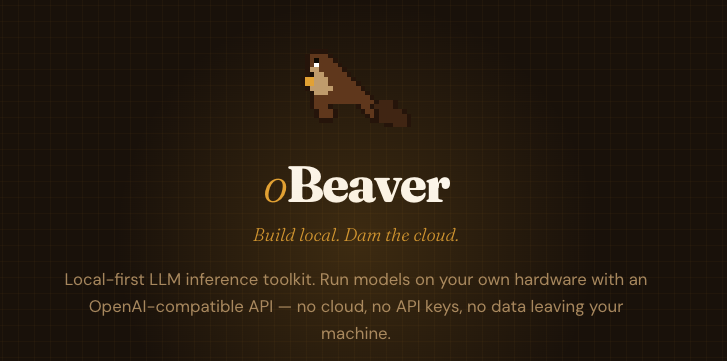
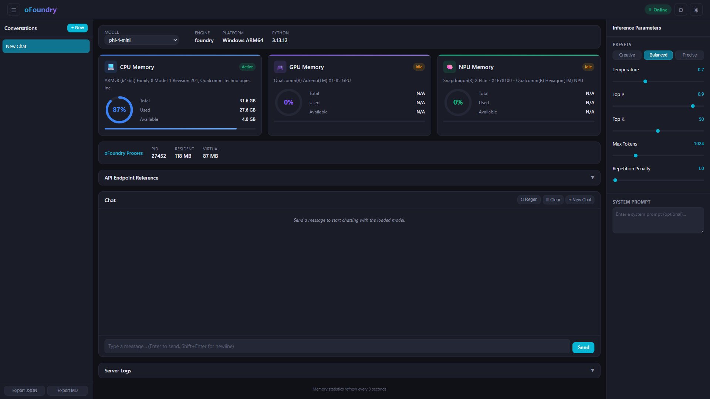
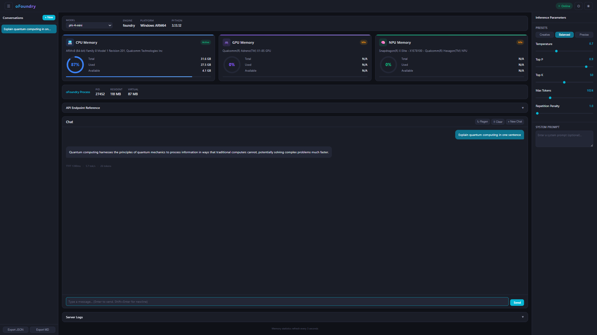
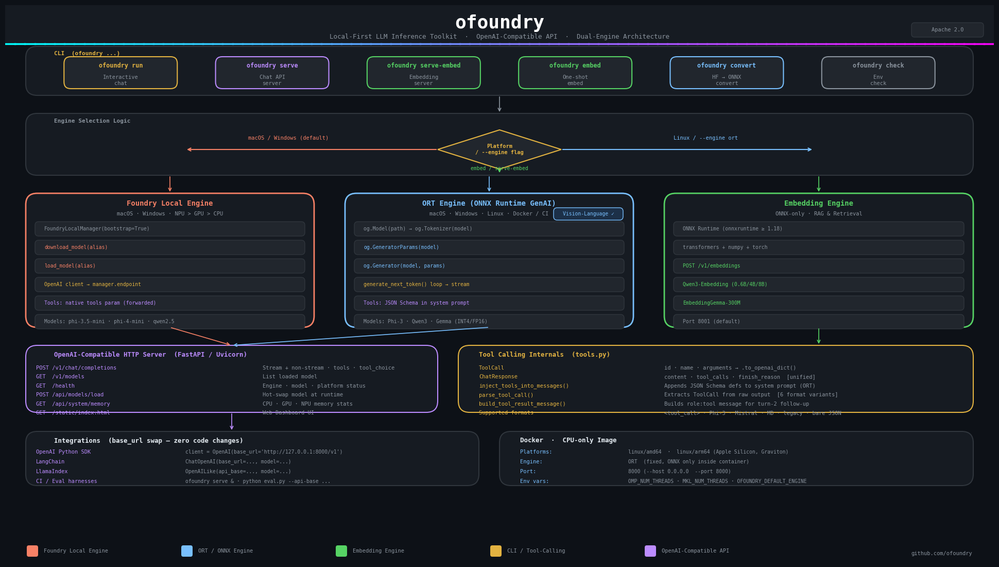

# oFoundry

<p align="center">
  
</p>

**oFoundry** 是一个本地优先的 LLM 推理工具包，专为需要在自有硬件上运行模型的 AI 开发者和工程师设计——无需云服务、无需 API 密钥、数据完全不离开你的设备。它提供 **OpenAI 兼容的 API**，让你现有的 Agent 流水线、RAG 技术栈和评估框架无需修改代码即可直接使用。

> English version: [README.md](README.md)

📖 **在线文档：** <https://microsoft.github.io/ofoundry>

---

## 目录

- [核心特性](#核心特性)
- [为什么选择 oFoundry？](#为什么选择-ofoundry)
- **快速入门**
  - [环境要求](#环境要求)
  - [安装](#安装)
  - [环境检查](#环境检查)
  - [获取模型](#获取模型)
- **基础用法**
  - [终端交互式对话](#终端交互式对话)
  - [启动 OpenAI 兼容 API 服务](#启动-openai-兼容-api-服务)
  - [网页仪表盘](#网页仪表盘)
- **进阶功能**
  - [文本嵌入（用于 RAG 和检索）](#文本嵌入用于-rag-和检索)
  - [工具调用（Agentic 工作流）](#工具调用agentic-工作流)
  - [模型转换](#模型转换)
- **示例与集成**
  - [使用 OpenAI Python SDK](#使用-openai-python-sdk)
  - [集成方案](#集成方案)
- **参考文档**
  - [API 参考](#api-参考)
  - [Docker](#docker)
  - [架构说明](#架构说明)
- [许可证](#许可证)

---

## 核心特性

- **双推理引擎** — 根据平台选择合适的后端：

  | 引擎 | 支持平台 | 说明 |
  |------|----------|------|
  | **Foundry Local**（macOS/Windows 默认） | macOS、Windows | 由 [Microsoft Foundry Local](https://github.com/microsoft/foundry-local) 驱动。自动下载模型、硬件加速（NPU > GPU > CPU），通过 catalog alias 启动。 |
  | **ORT**（Linux 默认） | macOS、Windows、**Linux** | 由 [ONNX Runtime GenAI](https://github.com/microsoft/onnxruntime-genai) 驱动。加载本地 `.onnx` 模型目录——完全离线、零云端依赖。 |

- **OpenAI 兼容 HTTP 服务** — `POST /v1/chat/completions`（流式 + 非流式）、`POST /v1/embeddings`
- **交互式 CLI 对话** — 支持多轮对话、耗时统计（TTFT、tok/s）和自定义系统提示词
- **函数/工具调用** — 完整支持 OpenAI `tools` + `tool_choice`，在本地构建 Agentic 工作流
- **文本嵌入** — 专用 ONNX 嵌入引擎（Qwen3-Embedding、EmbeddingGemma），用于 RAG 流水线
- **模型转换** — 通过内置 CLI 将 Hugging Face 模型转换为优化的 ONNX INT4/FP16 格式
- **Docker 支持** — 提供 `linux/amd64` 和 `linux/arm64`（Apple Silicon、AWS Graviton）CPU 容器

> **Linux 说明：** Linux 平台不支持 Foundry Local。引擎固定为 `ort`；传入 `--engine foundry` 将报错退出。

---

## 为什么选择 oFoundry？

| 痛点 | oFoundry 如何解决 |
|------|-------------------|
| **云端成本与延迟** | 在本地 CPU、GPU 或 NPU 上运行推理——零网络往返。 |
| **数据隐私** | 模型在设备上运行，数据完全不离开你的机器。 |
| **OpenAI SDK 绑定** | 提供即插即用的 `/v1/chat/completions` 和 `/v1/embeddings` 端点——只需更改 `base_url` 即可在本地与云端间切换。 |
| **多模型实验** | 通过一个 CLI 参数切换引擎和模型。轻松对比 Phi-3、Phi-4、Qwen、Gemma 等。 |
| **Linux / CI 无头环境** | 完全离线的 ORT 引擎随处可用——适合 Docker、CI 流水线和隔离网络服务器。 |
| **工具调用 / Agentic 工作流** | 两个引擎均内置 OpenAI function-calling 支持——在设备上构建完整的 Agent。 |

---

# 快速入门

本节将引导你完成 oFoundry 的安装和配置，让其在你的机器上运行起来。

## 环境要求

- **Python 3.12+**
- Foundry Local 系统守护进程（仅 macOS / Windows，用于 Foundry Local 引擎）：
  ```bash
  brew install microsoft/foundrylocal/foundrylocal   # macOS
  winget install Microsoft.FoundryLocal              # Windows
  ```

> **说明：** Linux 平台不支持 Foundry Local。引擎固定为 `ort`。

---

## 安装

```bash
git clone https://github.com/microsoft/ofoundry.git
cd ofoundry
pip install -e .
```

---

## 初始化模型目录

安装完成后，配置默认模型保存位置。这会自动创建所需的子目录（`ort/`、`foundrylocal/`、`cache_dir/`）：

```bash
ofoundry init
```

你也可以直接传入路径：

```bash
ofoundry init ~/my-models
```

> **💡 提示：** 配置保存在 `~/.ofoundry/config.json`。随时运行 `ofoundry`（不带参数）即可查看欢迎横幅，显示当前模型目录路径。

---

## 环境检查

验证你的环境：

```bash
ofoundry check
```

```
────────────────── ofoundry environment check ──────────────────
Platform: macOS

✓  Foundry Local CLI found: /usr/local/bin/foundry
   Version: 0.8.119
✓  foundry-local-sdk (Python) is installed.
   SDK version: 0.5.1
────────────────────────────────────────────────────────────────
```

### 列出本地模型

使用 `ofoundry models` 列出配置的模型目录下的所有本地模型：

```bash
ofoundry models
```

该命令会扫描 `foundrylocal/` 和 `ort/` 子文件夹，显示每个模型的名称、引擎类型和分类（Text、Vision + Text 或 Embeddings）。

---

## 获取模型

使用 oFoundry 前需要先准备模型，根据你的引擎选择获取方式：

### Foundry Local 目录（macOS/Windows）

无需手动下载——传入 catalog alias，Foundry 会自动处理：

```bash
ofoundry run Phi-4-mini-instruct-generic-cpu:5   # 首次使用时自动下载
```

> **💡 提示：** 运行 `ofoundry models` 列出所有本地缓存的模型。在 macOS/Windows 上，运行 `foundry model list` 浏览完整的 Foundry Local 目录获取更多别名。

### ONNX GenAI 模型（全平台）

从 Hugging Face 下载预转换模型。可搜索带有 `onnxruntime-genai` 标签的仓库，或使用 [Olive](https://github.com/microsoft/Olive) 自行转换。

> **🔑 需要 Hugging Face 身份验证：** 使用 `hf download` 或 `ofoundry convert` 下载模型需要 Hugging Face CLI 身份验证。如果你还未登录：
>
> ```bash
> pip install -U huggingface-hub
> huggingface-cli login
> ```
>
> 系统会提示你输入访问令牌。如果你还没有令牌，请访问 [huggingface.co/settings/tokens](https://huggingface.co/settings/tokens) 创建免费账户并生成令牌。部分受限模型（Llama、Mistral 等）还需要在 Hugging Face 模型页面上接受模型许可协议后才能下载。
>
> 你也可以使用环境变量替代登录：`export HF_TOKEN='your_token_here'`
>
> 运行 `ofoundry check` 验证你的 Hugging Face 身份验证状态。

```bash
# 安装 HF CLI
pip install -U "huggingface_hub[cli]"

# 下载 Phi-3 mini（INT4、CPU 优化）
hf download microsoft/Phi-3-mini-4k-instruct-onnx \
  --include "cpu_and_mobile/cpu-int4-rtn-block-32-acc-level-4/*" \
  --local-dir ./models/ort/phi3-mini-int4
```

### Embedding 模型

从 [huggingface.co/onnx-community](https://huggingface.co/onnx-community) 下载：

| 模型 | 参数量 | HF 仓库 |
|------|--------|---------|
| Qwen3-Embedding | 0.6B | `onnx-community/Qwen3-Embedding-0.6B` |
| Qwen3-Embedding | 4B | `onnx-community/Qwen3-Embedding-4B` |
| Qwen3-Embedding | 8B | `onnx-community/Qwen3-Embedding-8B` |
| EmbeddingGemma | 300M | `onnx-community/embeddinggemma-300m-ONNX` |

```bash
hf download onnx-community/Qwen3-Embedding-0.6B \
  --local-dir ./models/Qwen3-Embedding-0.6B
```

---

# 基础用法

oFoundry 已安装且模型就绪后，以下是核心使用方式。

## 终端交互式对话

在终端中启动交互式多轮对话。

**Foundry Local**（macOS/Windows——自动从目录下载模型）：
```bash
ofoundry run Phi-4-mini-instruct-generic-cpu:5
ofoundry run Phi-4-mini-instruct-generic-cpu:5 --timings   # 显示 TTFT + tok/s
```

**ORT 引擎**（全平台——指向本地 ONNX 模型目录）：
```bash
ofoundry run --engine ort ./models/phi3-mini-int4
```

**VL（视觉语言）模型** —— 引擎自动检测，无需指定 `--engine`：
```bash
ofoundry run ./models/Qwen2.5-VL-3B-Instruct_VL_ONNX_INT4_CPU
ofoundry run ./models/Qwen3-VL-2B-Instruct_VL_ONNX_INT4_CPU
```

> VL 模型只能使用 ORT 引擎。当检测到 VL 模型目录（包含 `vision.onnx`）时，引擎会自动切换为 `ort`，无需手动指定 `--engine ort`。

---

## 启动 OpenAI 兼容 API 服务

启动本地 HTTP 服务，暴露 OpenAI 兼容端点：

```bash
ofoundry serve Phi-4-mini-instruct-generic-cpu:5                          # Foundry Local
ofoundry serve --engine ort ./models/phi3-mini-int4   # ORT
ofoundry serve ./models/Qwen3-VL-2B-Instruct_VL_ONNX_INT4_CPU  # VL（自动检测）
```

服务启动后，任何 OpenAI 兼容客户端都可以连接到 `http://127.0.0.1:18000/v1`。

**VL 模型 curl 示例：**

```bash
# 本地图片
curl -s http://127.0.0.1:18000/v1/chat/completions \
  -H "Content-Type: application/json" \
  -d '{
    "messages": [{
      "role": "user",
      "content": [
        {"type": "image_url", "image_url": {"url": "./cat.jpg"}},
        {"type": "text", "text": "描述这张图片"}
      ]
    }]
  }'

# 远程图片 URL + 流式输出
curl -s http://127.0.0.1:18000/v1/chat/completions \
  -H "Content-Type: application/json" \
  -d '{
    "stream": true,
    "messages": [{
      "role": "user",
      "content": [
        {"type": "image_url", "image_url": {"url": "https://example.com/photo.jpg"}},
        {"type": "text", "text": "What is in this image?"}
      ]
    }]
  }'
```

---

## 网页仪表盘

使用 `dashboard` 命令启动实时监控仪表盘：

```bash
ofoundry dashboard               # Foundry Local 引擎，默认端口 1573
ofoundry dashboard -e ort         # ORT 引擎，扫描 ./models 下的 ONNX 模型
```

然后在浏览器中打开：

```
http://127.0.0.1:1573/
```

<p align="center">
  
</p>

仪表盘功能包括：

- **模型选择器** — 运行时切换已缓存的模型；NPU 加速模型标有 ⚡ 标识
- **系统信息栏** — 已加载的模型名称、引擎类型、平台和 Python 版本，实时健康状态
- **CPU 内存** — 总量、已用、可用及实时使用率仪表
- **GPU 内存** — 检测到的 GPU 设备及内存（NVIDIA、AMD、Intel、Qualcomm Adreno）
- **NPU 内存** — 检测到的 NPU 设备及内存（Intel Meteor Lake、Qualcomm Hexagon）
- **进程内存** — oFoundry 服务进程的驻留内存和虚拟内存
- **推理参数** — temperature、top-p、top-k、max tokens、repetition penalty，提供 Creative/Balanced/Precise 预设
- **聊天界面** — 直接在浏览器中向已加载的模型发送消息，支持流式响应和性能统计（TTFT、tok/s、token 计数）
- **会话历史** — 侧边栏保存对话记录，支持系统提示词配置
- **服务器日志** — 实时请求日志，包含方法、路径、状态和耗时
- **导出** — 将对话导出为 JSON 或 Markdown

<p align="center">
  
</p>

<p align="center">
  
</p>

内置聊天界面可直接在浏览器中测试模型，支持实时流式输出和性能指标：

<p align="center">
  
</p>

内存统计每 3 秒自动刷新。健康状态指示器显示服务是否在线。

---

# 进阶功能

## 文本嵌入（用于 RAG 和检索）

Embedding 引擎为**纯 ONNX**——无需 `--engine` 参数。

### CLI

```bash
# 单次嵌入
ofoundry embed ./models/Qwen3-Embedding-0.6B "你好，世界！"

# 交互式循环
ofoundry embed ./models/embeddinggemma-300m-ONNX
```

### 嵌入服务

```bash
ofoundry serve-embed ./models/Qwen3-Embedding-0.6B           # 默认端口 18001
ofoundry serve-embed ./models/embeddinggemma-300m-ONNX -p 8002
```

### 使用 OpenAI SDK

```python
from openai import OpenAI

client = OpenAI(base_url="http://127.0.0.1:18001/v1", api_key="unused")

response = client.embeddings.create(
    model="Qwen3-Embedding-0.6B",
    input=["你好，世界！", "文本嵌入非常有用。"],
)
for item in response.data:
    print(f"index={item.index}  dim={len(item.embedding)}")
```

---

## 工具调用（Agentic 工作流）

两个引擎均支持 [OpenAI function-calling](https://platform.openai.com/docs/guides/function-calling) 接口——在设备上构建能够规划、调用工具和推理的 Agent。

### 工作原理

| 引擎 | 策略 |
|------|------|
| **Foundry Local** | 工具定义通过标准 OpenAI `tools` 参数原生转发。响应可能携带原生 `tool_calls` 字段或 `functools[...]` 格式——两种格式均自动归一化。 |
| **ORT** | 工具以 JSON Schema 形式注入系统提示词。模型以 `<tool_call>{...}</tool_call>` 块回复，`parse_tool_call()` 负责提取和验证。 |

两个引擎返回相同的 `ChatResponse` 结构——你的应用代码与引擎无关。

### 支持的输出格式（自动检测）

| 格式 | 示例 |
|------|------|
| `<tool_call>` 块 | `<tool_call>{"name": "get_weather", "arguments": {"city": "Paris"}}</tool_call>` |
| Phi-3 原生格式 | `<\|function_calls\|>{...}<\|/function_calls\|>` |
| Mistral 风格 | `<functioncall>{...}</functioncall>` |
| Markdown 代码块 | `` ```json {...} ``` `` |
| OpenAI 旧版包装 | `{"function_call": {"name": ..., "arguments": ...}}` |
| 裸 JSON | `{"name": "...", "arguments": {...}}` |

### 示例：两轮工具调用 Agent

```python
from openai import OpenAI
import json

client = OpenAI(base_url="http://127.0.0.1:18000/v1", api_key="unused")

tools = [{
    "type": "function",
    "function": {
        "name": "get_weather",
        "description": "获取指定城市的当前天气",
        "parameters": {
            "type": "object",
            "properties": {"city": {"type": "string"}},
            "required": ["city"],
        },
    },
}]

messages = [{"role": "user", "content": "东京现在天气怎么样？"}]

# 第一轮——模型决定调用工具
resp = client.chat.completions.create(model="Phi-4-mini-instruct-generic-cpu:5", messages=messages, tools=tools)
choice = resp.choices[0]

if choice.finish_reason == "tool_calls":
    tool_call = choice.message.tool_calls[0]
    args = json.loads(tool_call.function.arguments)

    # 执行你的函数（替换为真实实现）
    weather_result = {"city": args["city"], "temperature": "18°C", "condition": "晴天"}

    # 第二轮——将工具结果发回模型进行推理
    messages += [
        choice.message,
        {
            "role": "tool",
            "tool_call_id": tool_call.id,
            "content": json.dumps(weather_result, ensure_ascii=False),
        },
    ]
    final = client.chat.completions.create(model="Phi-4-mini-instruct-generic-cpu:5", messages=messages)
    print(final.choices[0].message.content)
```

### curl 示例

```bash
# Foundry Local 引擎
ofoundry serve Phi-4-mini-instruct-generic-cpu:5
curl -s http://127.0.0.1:18000/v1/chat/completions \
  -H "Content-Type: application/json" \
  -d @tests/tool_foundrylocal_request.json

# ORT 引擎
ofoundry serve --engine ort ./models/phi3-mini-int4
curl -s http://127.0.0.1:18000/v1/chat/completions \
  -H "Content-Type: application/json" \
  -d @tests/tool_ort_request.json
```

---

## 模型转换

> **状态：** 正在开发中。目前仅支持 CPU 执行提供程序。

通过 CLI 直接将 Hugging Face 模型转换为优化的 ONNX 格式。

### 文本模型（默认）

```bash
# INT4 量化（最小、CPU 上最快）
ofoundry convert Qwen/Qwen3-0.6B
# → ./models/Qwen3-0.6B_ONNX_INT4_CPU

# FP16 精度
ofoundry convert Qwen/Qwen3-0.6B -p fp16

# 自定义输出 + 额外选项
ofoundry convert Qwen/Qwen3-0.6B -o ./my_model --extra-options 'shared_embeddings=true'
```

### 视觉语言（VL）模型

> **说明：** 当前 VL 模型转换仅支持 Qwen 2.5 VL 和 Qwen 3 VL。

VL 模型转换使用 [Olive](https://github.com/microsoft/Olive) 优化管道，参考 [olive-recipes](https://github.com/microsoft/olive-recipes)。它会导出三个子模型（文本解码器、视觉编码器、文本嵌入），并将其量化为 INT4。

#### 支持的 VL 模型

- `Qwen/Qwen2.5-VL-3B-Instruct`
- `Qwen/Qwen3-VL-2B-Instruct`

#### 转换命令

- **Qwen 2.5 VL**

  ```bash
  ofoundry convert Qwen/Qwen2.5-VL-3B-Instruct --type vl
  # → ./models/Qwen2.5-VL-3B-Instruct_VL_ONNX_INT4_CPU
  ```

- **Qwen 3 VL**（需要从源码构建 onnxruntime-genai 和 Olive）

  ```bash
  ofoundry convert Qwen/Qwen3-VL-2B-Instruct --type vl --build-from-source
  # → ./models/Qwen3-VL-2B-Instruct_VL_ONNX_INT4_CPU
  ```

> 对于 Qwen 3 VL，必须加上 `--build-from-source` 以确保与最新的 Olive 和 onnxruntime-genai 功能兼容。

| 参数 | 默认值 | 说明 |
|------|--------|------|
| `-m` / `--model` | *（必填）* | Hugging Face 模型名称或本地路径 |
| `-t` / `--type` | `text` | 模型类型：`text`（纯文本）或 `vl`（视觉语言） |
| `-o` / `--output` | `./models/<model>_ONNX_<PRECISION>_<EP>` | 输出目录 |
| `-p` / `--precision` | `int4` | `fp32`、`fp16`、`int4` |
| `-e` / `--ep` | `cpu` | 执行提供程序 |
| `--extra-options` | — | `KEY=VALUE` 键值对，传递给 onnxruntime-genai model builder（仅文本模型） |

---

# 示例与集成

## 使用 OpenAI Python SDK

```python
from openai import OpenAI

client = OpenAI(base_url="http://127.0.0.1:18000/v1", api_key="unused")

response = client.chat.completions.create(
    model="Phi-4-mini-instruct-generic-cpu:5",
    messages=[{"role": "user", "content": "法国的首都是哪里？"}],
    stream=True,
)
for chunk in response:
    print(chunk.choices[0].delta.content or "", end="", flush=True)
```

将任何 OpenAI 兼容框架（LangChain、LlamaIndex、Microsoft Agent Framework、CrewAI）指向 `http://127.0.0.1:18000/v1` 即可直接使用。

---

## 集成方案

### 与 LangChain 集成

```python
from langchain_openai import ChatOpenAI

llm = ChatOpenAI(
    base_url="http://127.0.0.1:18000/v1",
    api_key="unused",
    model="Phi-4-mini-instruct-generic-cpu:5",
)
response = llm.invoke("用一句话解释 ONNX Runtime。")
```

### 与 LlamaIndex 集成

```python
from llama_index.llms.openai_like import OpenAILike

llm = OpenAILike(
    api_base="http://127.0.0.1:18000/v1",
    api_key="unused",
    model="Phi-4-mini-instruct-generic-cpu:5",
)
```

### 在 CI / 自动评估中使用

```bash
# 在后台启动服务
ofoundry serve --engine ort ./models/phi3-mini-int4 &
sleep 5

# 对本地端点运行评估脚本
python eval.py --api-base http://127.0.0.1:18000/v1

# 清理
kill %1
```

---

# 参考文档

## API 参考

### 对话服务（`ofoundry serve`）

| 方法 | 路径 | 说明 |
|------|------|------|
| `GET` | `/` | 重定向到网页仪表盘 |
| `GET` | `/health` | 健康检查（包含模型名称和引擎标识） |
| `GET` | `/v1/models` | 列出已加载模型 |
| `POST` | `/v1/chat/completions` | 对话补全（支持流式与非流式） |
| `GET` | `/api/system/memory` | CPU、GPU、NPU 及进程内存统计 |
| `GET` | `/api/models/available` | 列出所有可切换的已缓存模型 |
| `POST` | `/api/models/load` | 运行时热切换活跃模型 |
| `GET` | `/static/index.html` | 网页仪表盘（自动提供） |

### 嵌入服务（`ofoundry serve-embed`）

| 方法 | 路径 | 说明 |
|------|------|------|
| `GET` | `/` | 重定向到网页仪表盘 |
| `GET` | `/health` | 健康检查 |
| `GET` | `/v1/models` | 列出已加载模型 |
| `POST` | `/v1/embeddings` | 计算文本嵌入向量 |
| `GET` | `/api/system/memory` | CPU、GPU、NPU 及进程内存统计 |
| `GET` | `/static/index.html` | 网页仪表盘（自动提供） |

### 请求参数（`/v1/chat/completions`）

| 参数 | 类型 | 默认值 | 说明 |
|------|------|--------|------|
| `model` | `string` | `""` | 模型标识符（信息性） |
| `messages` | `array` | *（必填）* | OpenAI 消息数组（`role` + `content`） |
| `stream` | `bool` | `false` | 启用 SSE 流式传输 |
| `max_tokens` | `int` | `1024` | 最大生成 token 数 |
| `temperature` | `float` | `1.0` | 采样温度 |
| `top_p` | `float` | `1.0` | 核采样 |
| `top_k` | `int` | `50` | Top-k 采样 |
| `repetition_penalty` | `float` | `1.0` | 重复惩罚（1.0 = 关闭） |
| `tools` | `array` | `null` | OpenAI 函数定义 |
| `tool_choice` | `string\|object` | `null` | 工具选择策略 |

---

## Docker

提供 `linux/amd64` 和 `linux/arm64` 的纯 CPU Docker 镜像。

### 构建

```bash
# x86_64
docker buildx build --platform=linux/amd64 \
  -f docker/Dockerfile.cpu -t ofoundry-cpu .

# arm64（Apple Silicon / Graviton——从源码编译 ORT）
docker buildx build --platform=linux/arm64 \
  -f docker/Dockerfile.cpu -t ofoundry-cpu .
```

| 构建参数 | 默认值 | 说明 |
|----------|--------|------|
| `PYTHON_VERSION` | `3.12` | Python 版本 |
| `ORT_GENAI_REF` | `v0.6.0` | onnxruntime-genai git 标签（arm64 源码构建） |

### 运行

```bash
# 交互式对话
docker run -it --rm \
  -v /path/to/models/phi3-mini-int4:/models \
  ofoundry-cpu run -m /models -E ort

# API 服务（绑定所有网络接口）
docker run -d --rm -p 18000:18000 \
  -v /path/to/models/phi3-mini-int4:/models \
  ofoundry-cpu serve -m /models -E ort --host 0.0.0.0 --port 18000

curl http://localhost:18000/health
```

### 环境变量

| 变量 | 默认值 | 说明 |
|------|--------|------|
| `OMP_NUM_THREADS` | `4` | OpenMP 线程数 |
| `MKL_NUM_THREADS` | `4` | MKL 线程数 |
| `TOKENIZERS_PARALLELISM` | `false` | 禁用 HuggingFace tokenizer 并行警告 |
| `OFOUNDRY_DEFAULT_ENGINE` | `ort` | 未指定 `--engine` 时的默认引擎 |

---

## 架构说明




```
ofoundry/
├── cli.py                  # Typer CLI：chat、serve、embed、serve-embed、convert、check
├── server.py               # FastAPI OpenAI 兼容服务（对话 + 嵌入 + 仪表盘）
├── chat.py                 # 交互式多轮对话终端循环
├── engine_foundrylocal.py  # FoundryEngine — 封装 foundry-local-sdk
├── engine_ort.py           # OrtEngine — 封装 onnxruntime-genai
├── engine_embedding.py     # EmbeddingEngine — 纯 ONNX 文本嵌入
├── monitor.py              # 系统资源监控（CPU、GPU、NPU 内存）
├── tools.py                # 工具调用：parse_tool_call()、inject_tools_into_messages()
├── config.py               # ServerConfig 数据类
├── convert_vl.py           # 视觉语言模型转换（通过 Olive）
└── static/
    └── index.html          # 网页仪表盘 UI（实时内存仪表盘）
```

### 引擎选择逻辑

| 条件 | 引擎 | 模型参数 |
|------|------|----------|
| macOS / Windows（默认） | Foundry Local | Catalog alias（如 `Phi-4-mini-instruct-generic-cpu:5`） |
| `--engine ort` 或 Linux（默认） | onnxruntime-genai | 本地目录路径 |
| `embed` / `serve-embed` 命令 | EmbeddingEngine（ONNX） | 本地 ONNX 模型目录 |

### Foundry Local 引擎流程

```
FoundryLocalManager(bootstrap=True)
  → download_model(alias)
  → load_model(alias)
  → OpenAI client 通过 manager.endpoint 流式推理
```

### ORT 引擎流程

```
og.Model(path) → og.Tokenizer(model) → og.GeneratorParams(model)
  → og.Generator(model, params) → generate_next_token() 循环 → 流式输出 token
```

### 工具调用内部实现

| 组件 | 作用 |
|------|------|
| `ToolCall` | 数据类：`id`、`name`、`arguments` → `.to_openai_dict()` |
| `ChatResponse` | 引擎统一响应结构：`content`、`tool_calls`、`finish_reason` |
| `inject_tools_into_messages()` | 将 JSON Schema 工具定义追加到系统提示词（ORT 路径） |
| `parse_tool_call()` | 从模型原始输出中提取 `ToolCall`；处理 6 种格式变体 |
| `build_tool_result_message()` | 构建第二轮对话中发回的 `role: tool` 消息 |

---

## 致谢

oFoundry 的灵感来源于以下优秀的开源项目，并在其理念基础上构建：

| 项目 | 说明 |
|------|------|
| [Ollama](https://github.com/ollama/ollama) | 通过简洁的 CLI 在本地运行大语言模型 |
| [OMLX](https://github.com/jundot/omlx) | 在 Apple Silicon 上运行大语言模型，基于 ONNX |
| [vLLM](https://github.com/vllm-project/vllm) | 高吞吐量、高内存效率的 LLM 推理引擎 |
| [Foundry Local](https://github.com/microsoft/foundry-local) | 微软本地模型推理运行时，支持 NPU/GPU/CPU 加速 |
| [ONNX Runtime GenAI](https://github.com/microsoft/onnxruntime-genai) | ONNX Runtime 的生成式 AI 扩展 |

---

## 许可证

Apache 2.0
